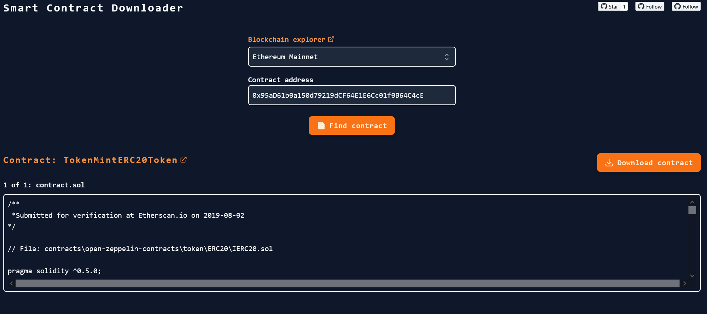

# Smart Contract Downloader

This is a smart contract downloader which uses Etherscan, PolygonScan and BSCScan API to get verified contracts source code.

After finding the desired contract you can download the package as a compressed zip file.
**********************************************************************************************************************************


********************************************************************************************************************************

## Current networks 

- Ethereum Mainnet
- Sepolia Testnet
- Polygon Mainnet
- Polygon Mumbai Testnet
- Binance Smart Chain Mainnet
- Binance Smart Chain Testnet
- Arbitrum One Mainnet
- Arbitrum Nova Mainnet
- Arbitrum Goerli Testnet
- Fantom Mainnet
- Fantom Testnet

## Development - Getting started
* ```.env``` Add your etherscan api key to the environments file and save.
* ```npm install``` to add the dependencies.
* ```npm dev``` to start the dev server on [http://localhost:3000](http://localhost:3000) 
* ```npm build``` to create an optimised build.
* ```npm start``` to check your build om [http://localhost:3000](http://localhost:3000) 
* Deploy your build : upload to server.

**********************************************************************************************************************************
Apache 2.0
***********************************************************************************************************************************
